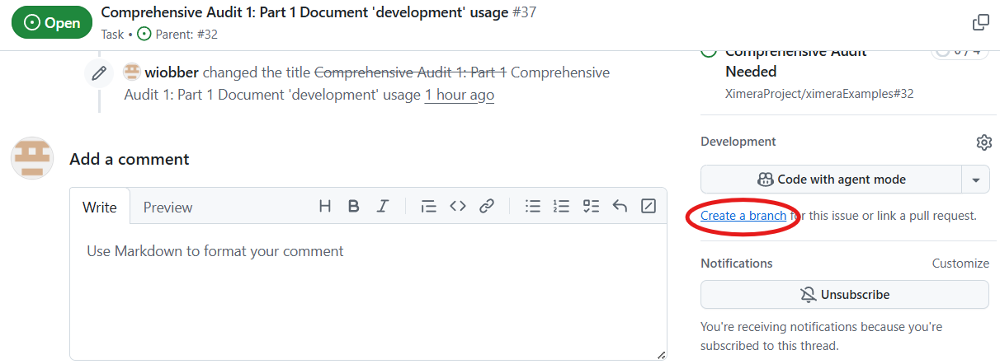

# A simple test scenario

If you just want to *test* or *try* something, and do not plan to commit any changes, just checkout this repo, build it, adapt either a particular testfile or a Ximera setting in xmScripts/config and/or .devcontainer/docker-compose.yml, and rebuild.

# A simple development of a new testcase

* Choose or make an Issue in ximeraExamples
* Create a branch, with name <issue-number>-short-description 
   
* Fork, clone and checkout this branch in your copy of ximeraExamples
```
~/git/ximera/ximeraExamples$ git checkout -b 42-test-link
Switched to a new branch '42-test-link'
```

* Setup the to be tested/changed ximeraLatex version:
  * if testing a dockerimage, update config.txt(local PC) or docker_compose.yml (in Codespace)
     * if you need to try a fix to the contents of the dockerimage, use can use 'xmlatex copySettingsLocal' to create a .ximera_local with the ximeraLatex contents from the current image.
  * if testing an existing ximeraLatex branch (perhaps on a clone somewhere) : check it out in .ximera_local
  * if making new changes to ximeraLatex: fork, clone, and checkout a new branch

```
~/git/ximera/ximeraExamples$ git clone https://github.com/bartsnapp/ximeraLatexFrameDev.git .ximera_local
Cloning into '.ximera_local'...
remote: Enumerating objects: 4273, done.
remote: Counting objects: 100% (284/284), done.
remote: Compressing objects: 100% (92/92), done.
remote: Total 4273 (delta 208), reused 193 (delta 192), pack-reused 3989 (from 3)
Receiving objects: 100% (4273/4273), 6.12 MiB | 4.84 MiB/s, done.
Resolving deltas: 100% (2753/2753), done.
```
* Use, update or create a relevant test 
   * you can use the VSCode 'PDF' or 'HTML' buttons, or the xmlatex script (see infra)
   * note the 'USING .ximera_local from local repo' line in the output when you made a .ximera_local
   * the .log file will contain detailed info about which files where actually used/included
```
~/git/ximera/ximeraExamples$ xmlatex ghaction dtxTests/link/xoe.tex 
Restarting myself in docker (from image ghcr.io/ximeraproject/ximeralatex:v2.7.2)
Starting /usr/local/bin/xmlatex ghaction dtxTest/link/link/xourse.tex (on host docker-desktop, i.e. inside a docker container)
USING .ximera_local from local repo
Starting Github-action build (name; bake/frost/serve)
[INFO   ] main : Set compile_sequence=pdf,html (and output_formats=pdf,html)
...
```
   * Verify the output

* If you made useful changes in .ximera_local : commit and push, make a pull request for ximeraLatex
* If you made useful changes in ximeraExamples: commit and push, make a pull request for ximeraExamples
* when in doubt, or when this procedure does not work as advertized: contact ximera-project!

# A completely new test

* Same as before, but either add the test(s) to an existing or a  new folder under `compositeTests`, or make a new folder named  `branchname`.
* (r-e)move the `branchname`folder before merging into main. 

# A new ximeraLatex development
* Same as before, but checkout your development ximeraLatex branch into .ximera_local, and even commit and push it into your ximeraExamples branch. 
* Remove the .ximera_local folder before merging into main.


