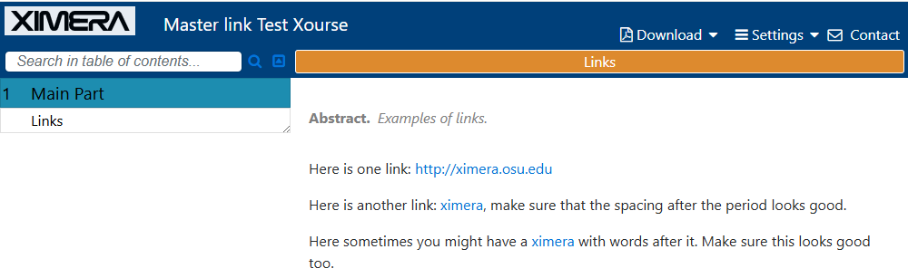

Testing session:

```

wiobb@GHUM-L-EJ305KR2:~/git/ximera/ximeraExamples$ git pull
Already up to date.

wiobb@GHUM-L-EJ305KR2:~/git/ximera/ximeraExamples$ git checkout -b test-link
Switched to a new branch 'test-link'

wiobb@GHUM-L-EJ305KR2:~/git/ximera/ximeraExamples$ git clone https://github.com/bartsnapp/ximeraLatexFrameDev.git .ximera_local
Cloning into '.ximera_local'...
remote: Enumerating objects: 4273, done.
remote: Counting objects: 100% (284/284), done.
remote: Compressing objects: 100% (92/92), done.
remote: Total 4273 (delta 208), reused 193 (delta 192), pack-reused 3989 (from 3)
Receiving objects: 100% (4273/4273), 6.12 MiB | 4.84 MiB/s, done.
Resolving deltas: 100% (2753/2753), done.

wiobb@GHUM-L-EJ305KR2:~/git/ximera/ximeraExamples$ xmlatex ghaction testXourses.TODO/linkTest.tex 
Restarting myself in docker (from image ghcr.io/ximeraproject/ximeralatex:v2.7.0)
Starting /usr/local/bin/xmlatex ghaction testXourses.TODO/linkTest.tex (on host docker-desktop, i.e. inside a docker container)
USING .ximera_local from local repo
Starting Github-action build (name; bake/frost/serve)
[INFO   ] main : Set compile_sequence=pdf,html (and output_formats=pdf,html)
[INFO   ] main : Processing argument 1: testXourses.TODO/linkTest.tex
[INFO   ] files: Marked source tex          NO_COMPILATION     for examples.TODO/links/links.tex
[INFO   ] files: Marked source tex          NEEDS_COMPILATIONS for testXourses.TODO/linkTest.tex
[STATUS ] main : 1 file needs compiling: testXourses.TODO/linkTest.tex
[STATUS ] main : Start bake
[INFO   ] bake : Added 2 compile commands for file   1/1: testXourses.TODO/linkTest.tex
[STATUS ] bake : There are 2 commands to run for 1 files
[STATUS ] bake : Command   1/2 (1) starting for  pdf of testXourses.TODO/linkTest.tex (pdf|testXourses.TODO/linkTest.tex)
[STATUS ] bake : Command   2/2 (2) starting for html of testXourses.TODO/linkTest.tex (html|testXourses.TODO/linkTest.tex)
[STATUS ] bake : Command   2/2 (2) returns OK after 7.5 seconds (0 failed) for html of testXourses.TODO/linkTest.tex
[INFO   ] bake : Command html|testXourses.TODO/linkTest.tex scheduled for RETRY (was job 2 (2))
[STATUS ] bake : Command  2r/2 (2) starting for html of testXourses.TODO/linkTest.tex (html|testXourses.TODO/linkTest.tex)
[INFO   ] bake : Moving /code/testXourses.TODO/linkTest.pdf to ximera-downloads/with-answers/testXourses.TODO/linkTest.pdf
[STATUS ] bake : Command   1/2 (1) returns OK after 10.0 seconds (0 failed) for pdf of testXourses.TODO/linkTest.tex
[INFO   ] html : No parts found, adding one, as this is needed in (some versions of) the ximeraServer
[INFO   ] html : Adapted html being saved as testXourses.TODO/linkTest.html (/code/testXourses.TODO/linkTest.html)
[STATUS ] bake : Command  2r/2 (2) returns OK after 5.0 seconds (0 failed) for html of testXourses.TODO/linkTest.tex
[STATUS ] bake : Finished compiling 1 files in 13.6 seconds
[STATUS ] main : Bake succeeded: Baked 1 files, no errors found
[INFO   ] main : Mmm, file testXourses.TODO/linkTest.tex still needs compilation.
[INFO   ] main : Still 1 files to be compiled after bake.
[STATUS ] main : Start frost
[WARNING] frost: There are 2 uncommitted files; should serve only to localhost
[WARNING] frost: There are 1 file to be compiled; should serve only to localhost
[INFO   ] frost: Adding XOURSE testXourses.TODO/linkTest.tex (Master link Test Xourse)
[INFO   ] frost: Found publications/0333286ab0e4c1ceb1046418afcc88032080ff59  (tree:e58298d99203d801017d707c551651ab53fdce1f tag:0333286ab0e4c1ceb1046418afcc88032080ff59) 
[STATUS ] frost: Creating tag publications/a40cd692e6e6af56fd0ce8fc37f7db318d567d35 for a40cd692e6e6af56fd0ce8fc37f7db318d567d35
[STATUS ] main : Frost succeeded: Created publications/a40cd692e6e6af56fd0ce8fc37f7db318d567d35
[STATUS ] main : Start serve
[INFO   ] frost: Publishing to localhost: http://localhost:2000/ximeraexamples.git
[STATUS ] frost: Forced serving (git push -f ximera publications/a40cd692e6e6af56fd0ce8fc37f7db318d567d35)
[STATUS ] frost: Forced serving (git push -f ximera a40cd692e6e6af56fd0ce8fc37f7db318d567d35:refs/heads/master)
[STATUS ] main : Serve succeeded: Published  publications/a40cd692e6e6af56fd0ce8fc37f7db318d567d35to  http://localhost:2000/ximeraexamples

```




